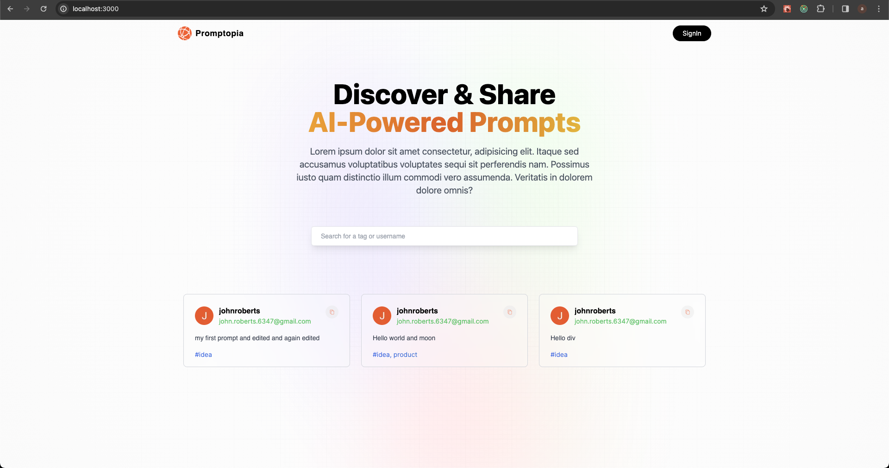
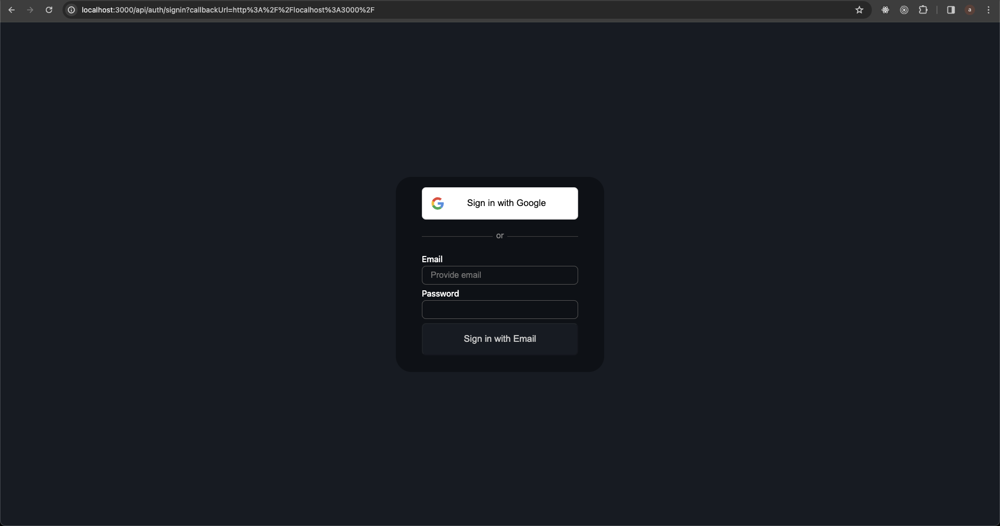
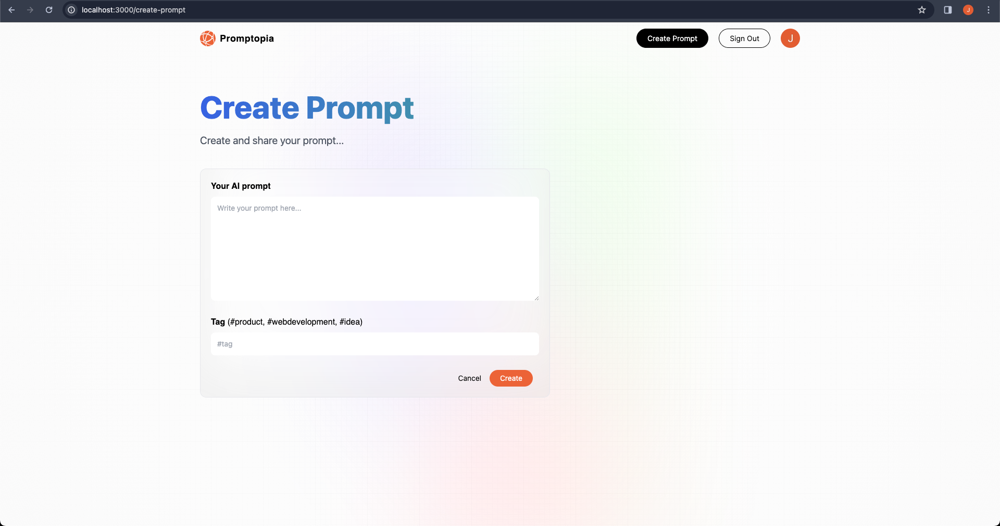
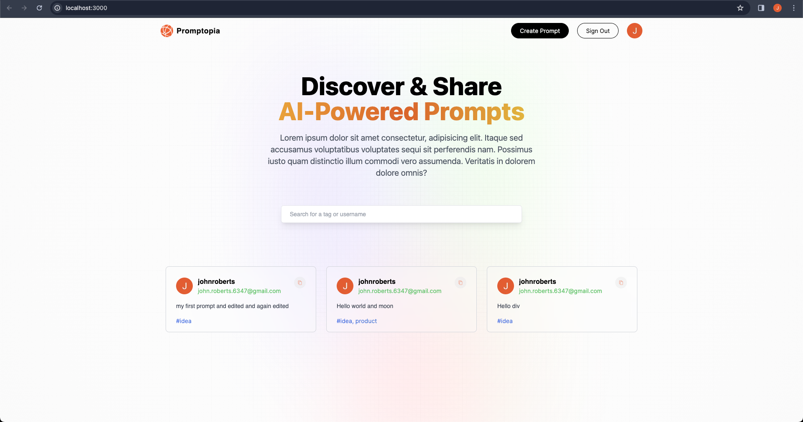

## Promptopia

A nextjs (v13.4) based search and crud app to create/manage AI prompts.
As of now, prompts are created manually but going forward app will be integrated with chatgpt/OpenAI
api's to facilitate it.

### Next-Auth

next-auth is used to provide OAuth provider ( google ) and credentials provider.
Would fix credentials provider. As of now, using hard coded values but flow works as per next-auth specifications.

### How to run

Spin up your own local mongo database or use a hosted one.
Configure connection strings via .env file in the root of the project and it should work.

For, google auth, as of now only one dev user is configured in google app to allow logging.

### Screenshots

Following are few screenshots.

#### Home/Landing page

#### Sign-In Provider

#### Create your own prompt

#### Signed In view

